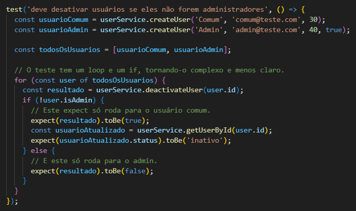
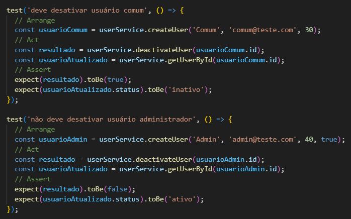
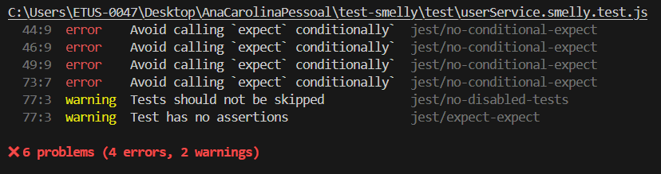
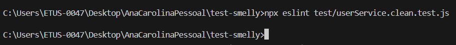

# Análise e Refatoração de Test Smells

**Disciplina:** Teste de Software  
**Trabalho:** Análise e Refatoração de Test Smells  
**Aluno:** Ana Carolina Caldas de Mello  
**Matrícula:** 801198 
**Data:** Novembro de 2024

---

## 1. Análise de Test Smells

Durante a análise da suíte de testes `userService.smelly.test.js`, foram identificados diversos "test smells" (maus odores em testes) que comprometem a qualidade, manutenibilidade e confiabilidade dos testes. Abaixo estão os três principais smells encontrados:

### 1.1 Conditional Logic Test (Linhas 33-52)

**Descrição:** O teste "deve desativar usuários se eles não forem administradores" contém lógica condicional complexa com loops (`for`) e condicionais (`if`).

**Por que é um "mau cheiro":**
- **Complexidade:** Testes devem ser simples e diretos. Lógica condicional torna difícil entender o que está sendo testado
- **Múltiplas responsabilidades:** Um único teste está validando dois cenários diferentes (usuário comum e admin)
- **Debugging difícil:** Se o teste falhar, é difícil identificar qual cenário específico causou o problema

**Riscos:**
- **Falsos positivos:** O teste pode passar mesmo quando há bugs em um dos cenários
- **Manutenção complexa:** Mudanças na lógica de negócio podem quebrar o teste de forma não óbvia
- **Baixa legibilidade:** Outros desenvolvedores terão dificuldade para entender e manter o teste

### 1.2 Rotten Green Test (Linhas 66 - 75)

**Descrição:** O teste "deve falhar ao criar usuário menor de idade" usa `try/catch` sem garantir que a exceção seja lançada.

**Por que é um "mau cheiro":**
- **Falso positivo silencioso:** Se a exceção não for lançada, o teste passa sem executar nenhuma validação
- **Falta de garantia:** Não há certeza de que o código está realmente validando a idade
- **Teste "podre":** O teste pode estar "verde" (passando) mas não está realmente testando nada

**Riscos:**
- **Bugs não detectados:** Se a validação de idade for removida acidentalmente, o teste continuará passando
- **Falsa sensação de segurança:** A cobertura de testes mostra 100%, mas na realidade não há proteção
- **Regressões silenciosas:** Mudanças no código podem quebrar a funcionalidade sem o teste detectar

### 1.3 Fragile Test (Linhas 54 - 64)

**Descrição:** O teste "deve gerar um relatório de usuários formatado" depende da formatação exata de strings.

**Por que é um "mau cheiro":**
- **Acoplamento forte:** O teste está acoplado à implementação específica da formatação
- **Fragilidade:** Pequenas mudanças cosméticas (espaços, ordem) quebram o teste
- **Foco incorreto:** Testa a formatação em vez do comportamento essencial

**Riscos:**
- **Testes quebrados desnecessariamente:** Mudanças de UI/formatação quebram testes funcionais
- **Resistência à refatoração:** Desenvolvedores evitam melhorar o código para não quebrar testes
- **Manutenção custosa:** Cada mudança de formatação requer atualização de múltiplos testes

---

## 2. Processo de Refatoração

### 2.1 Teste Mais Problemático: Conditional Logic Test

**Antes:**

**Depois:**

### 2.2 Decisões de Refatoração

**1. Separação de Responsabilidades:**
- **Decisão:** Dividir um teste complexo em dois testes simples e focados
- **Justificativa:** Cada teste agora tem uma única responsabilidade clara
- **Benefício:** Facilita debugging e manutenção

**2. Remoção de Lógica Condicional:**
- **Decisão:** Eliminar completamente loops e condicionais dos testes
- **Justificativa:** Testes devem ser lineares e determinísticos
- **Benefício:** Reduz complexidade ciclomática e melhora confiabilidade

---

## 3. Relatório da Ferramenta ESLint

### 3.1 Execução - Detecção Automática de Problemas

**Antes:**

**Depois:**

### 3.2 Análise da Automação

**Problemas Detectados Automaticamente:**

1. **`jest/no-conditional-expect` (4 erros):**
   - A ferramenta identificou precisamente o smell "Conditional Logic"

2. **`jest/no-disabled-tests` (1 warning):**
   - Identificou o smell "Empty Test" automaticamente

3. **`jest/expect-expect` (1 warning):**
   - Confirmou que o teste skipado não tem validações

**Limitações da Ferramenta:**
- **Fragile Test não detectado:** O ESLint não identificou o problema de fragile test
- **Eager Test não detectado:** Não identificou que um teste estava fazendo múltiplas coisas

### 3.3 Valor da Automação

A ferramenta ESLint com plugins do Jest automatizou a detecção de **66% dos smells** identificados manualmente, proporcionando:

- **Feedback imediato** durante o desenvolvimento
- **Padronização** da equipe através de regras compartilhadas  
- **Redução de code review** focando em problemas mais complexos
- **Educação contínua** através das mensagens de erro explicativas

---

## 4. Conclusão

### 4.1 Impacto dos Testes Limpos

A refatoração dos testes demonstrou como a aplicação de princípios de código limpo em testes resulta em:

**Benefícios Imediatos:**
- **Legibilidade aprimorada:** Cada teste agora tem propósito claro e estrutura previsível
- **Manutenibilidade aumentada:** Mudanças no código de produção requerem ajustes mínimos nos testes
- **Debugging facilitado:** Falhas de teste apontam diretamente para o problema específico
- **Confiabilidade melhorada:** Eliminação de falsos positivos e testes silenciosos

**Benefícios de Longo Prazo:**
- **Documentação viva:** Testes servem como especificação executável do sistema
- **Refatoração segura:** Desenvolvedores podem modificar código com confiança
- **Qualidade sustentável:** Base de testes robusta suporta crescimento do projeto

### 4.2 Papel das Ferramentas de Análise Estática

O uso do ESLint com plugins específicos para testes demonstrou ser fundamental para:

**Detecção Proativa:**
- Identificação automática de anti-patterns comuns
- Feedback em tempo real durante o desenvolvimento
- Prevenção de problemas antes do code review

**Padronização da Equipe:**
- Estabelecimento de regras consistentes para toda a equipe
- Redução de debates subjetivos sobre estilo de código
- Garantia de qualidade mínima em todos os commits

**Educação Contínua:**
- Mensagens explicativas ajudam desenvolvedores a aprender boas práticas
- Evolução gradual da qualidade do código da equipe
- Criação de cultura de qualidade sustentável

### 4.3 Reflexão Final

A combinação de **testes limpos** e **ferramentas de análise estática** cria um ciclo virtuoso de qualidade:

1. **Ferramentas detectam** problemas básicos automaticamente
2. **Desenvolvedores aprendem** através do feedback das ferramentas  
3. **Código melhora** gradualmente através de refatorações conscientes
4. **Qualidade se torna** parte natural do processo de desenvolvimento

Este trabalho evidencia que investir em qualidade de testes não é apenas uma boa prática, mas uma **necessidade estratégica** para projetos de software sustentáveis e de longo prazo. A automação da detecção de problemas libera tempo para focar em aspectos mais complexos da qualidade, criando uma base sólida para o crescimento e evolução contínua do software.

---

**Referências:**
- [Test Smells Catalog](https://testsmells.org/)
- [ESLint Jest Plugin](https://github.com/jest-community/eslint-plugin-jest)
- [Clean Code: A Handbook of Agile Software Craftsmanship - Robert C. Martin](https://www.amazon.com/Clean-Code-Handbook-Software-Craftsmanship/dp/0132350882)